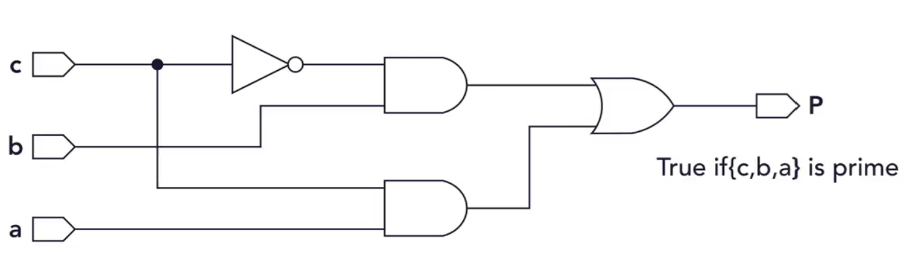

# 🛠️ Converting Schematic to Verilog Code 🚀

Welcome to the **Schematic to Code** project! This repository showcases three approaches to implementing a digital circuit in Verilog based on a provided schematic. The circuit determines whether the binary number formed by three inputs (`c`, `b`, `a`) is a **prime number**.

## 📜 Problem Statement

Given a 3-input logic circuit, implement it in Verilog. The circuit outputs `P = 1` (True) when the number represented by `{c, b, a}` is a prime number. The inputs represent a 3-bit binary number where:

- `c`: Most Significant Bit (MSB)
- `b`: Middle Bit
- `a`: Least Significant Bit (LSB)

### 🎯 Prime Numbers for `{c, b, a}`:
- **Prime Numbers**: `2`, `3`, `5`, `7`
- **Not Prime**: `0`, `1`, `4`, `6`

## 🏗️ Implementations

This project provides **three approaches** to implement the circuit:

### 1. **Gate-Based Implementation**

This method uses basic logic gates (`NOT`, `AND`, `OR`) to directly replicate the schematic.

### 2. **Boolean Algebra Implementation**

This method uses Boolean algebra to simplify the circuit into a single-line expression.

### 3. **Procedural Implementation**

This approach uses procedural logic to determine if the number is prime based on numerical values.

## 🌟 Key Learnings

- Understand how to translate a schematic into Verilog code.
- Explore different approaches to implement the same functionality:

1. Gate-based design
2. Boolean algebra
3. Behavioral (procedural) modeling
